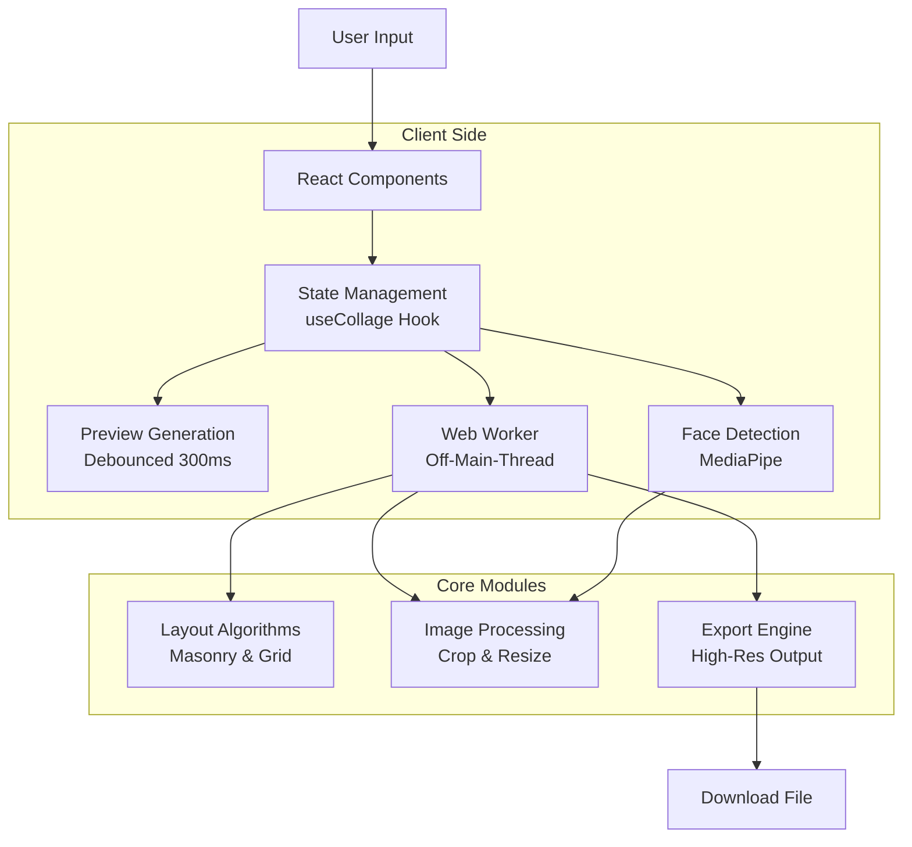
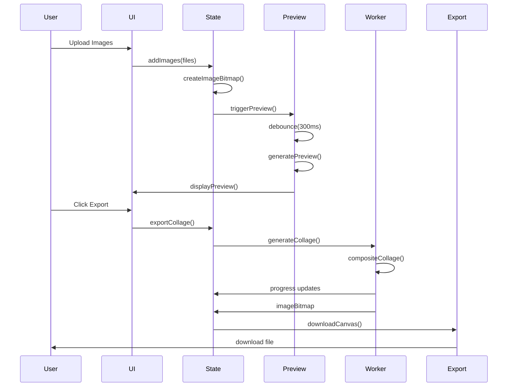
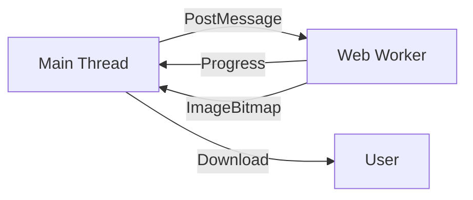
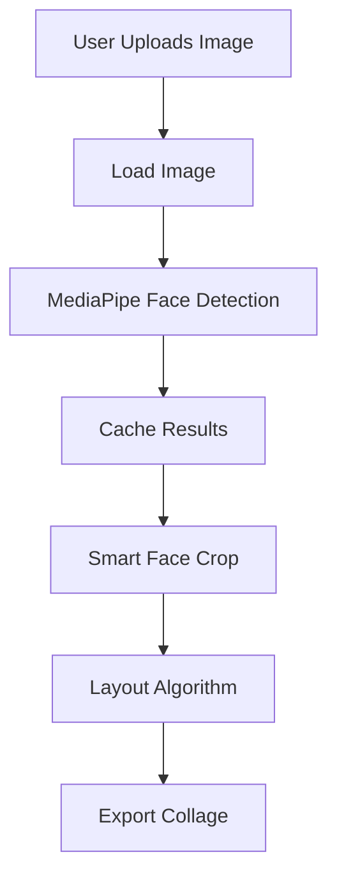

# PhotoWeave Architecture

## High-Level Architecture

PhotoWeave is a client-side application that processes all image data in the browser. The architecture is designed around performance, privacy, and user experience.

### Architecture Overview



### Key Architectural Decisions

1. **Client-Side Only**: No server-side processing ensures privacy and reduces infrastructure costs
2. **Web Workers**: Heavy image processing runs off the main thread for smooth UI
3. **Debounced Preview**: 300ms delay prevents excessive re-renders during configuration changes
4. **Lazy Loading**: MediaPipe face detection loads only when needed
5. **Type-Safe Configuration**: TypeScript interfaces for all configuration options

## Data Flow

### Image Upload to Export Flow



### Component Hierarchy

```
src/app/
├── layout.tsx              # Root layout
├── page.tsx                # Landing page
└── collage/
    └── page.tsx            # Main collage editor
        ├── ImageUploader
        ├── CollageCanvas
        ├── ConfigPanel
        ├── ExportButton
        └── GridOptimization

src/components/
├── Navbar.tsx
├── Footer.tsx
├── ThemeToggle.tsx
├── AmbientBackground.tsx
└── collage/
    ├── ImageUploader.tsx
    ├── CollageCanvas.tsx
    ├── ConfigPanel.tsx
    ├── ExportButton.tsx
    └── GridOptimization.tsx
```

## State Management

### useCollage Hook

The `useCollage` hook is the central state management for the collage editor:

```typescript
interface CollageState {
  // Images
  images: LoadedImage[];
  addImages: (files: File[]) => void;
  removeImage: (index: number) => void;
  clearImages: () => void;
  shuffleImages: () => void;
  sortImagesChronologically: () => void;

  // Configuration
  config: CollageConfig;
  setConfig: (config: Partial<CollageConfig>) => void;

  // Preview
  previewCanvas: HTMLCanvasElement | null;
  isGenerating: boolean;
  progress: number;

  // Grid info
  gridInfo: GridInfo | null;

  // Export
  exportCollage: () => Promise<void>;
}
```

### Theme State (Zustand)

Theme management uses Zustand with localStorage persistence:

```typescript
interface ThemeState {
  theme: "light" | "dark";
  setTheme: (theme: "light" | "dark") => void;
  toggleTheme: () => void;
}
```

## Web Worker Implementation

### Worker Architecture

PhotoWeave uses Web Workers to offload heavy image processing from the main thread:



### Worker Bridge

The `worker-bridge.ts` module manages worker lifecycle:

```typescript
// src/lib/collage/worker-bridge.ts

export async function generateCollageWithWorker(
  images: LoadedImage[],
  config: CollageConfig,
  onProgress: (percent: number) => void,
): Promise<HTMLCanvasElement> {
  // Create worker
  const worker = createWorker();

  // Send data
  worker.postMessage({
    images: images.map((img) => ({
      bitmap: img.bitmap,
      width: img.width,
      height: img.height,
      aspect: img.aspect,
    })),
    config,
  });

  // Listen for progress
  worker.onmessage = (e) => {
    if (e.data.type === "progress") {
      onProgress(e.data.percent);
    }
  };

  // Wait for completion
  const result = await new Promise<ImageBitmap>((resolve) => {
    worker.onmessage = (e) => {
      if (e.data.type === "done") {
        resolve(e.data.imageBitmap);
      }
    };
  });

  // Terminate worker
  worker.terminate();

  // Convert to canvas
  const canvas = document.createElement("canvas");
  canvas.width = result.width;
  canvas.height = result.height;
  const ctx = canvas.getContext("2d");
  ctx.drawImage(result, 0, 0);

  return canvas;
}
```

### Fallback Strategy

If Web Workers are not supported or fail, the application falls back to main-thread processing:

```typescript
if (typeof OffscreenCanvas === "undefined") {
  // Fallback to main thread
  return generateCollage(images, config, onProgress);
}
```

## Face Detection Integration

### MediaPipe Integration

Face detection uses Google's MediaPipe BlazeFace model:



### Main Thread Limitation

MediaPipe does not support Web Workers, so face detection runs on the main thread:

```typescript
// src/lib/collage/face-detection.ts

let faceDetector: FaceDetector | null = null;

export async function detectFaces(
  canvas: HTMLCanvasElement,
): Promise<FaceDetection[]> {
  // Lazy load MediaPipe
  if (!faceDetector) {
    const vision = await FilesetResolver.forVisionTasks(
      "https://cdn.jsdelivr.net/npm/@mediapipe/tasks-vision@0.10.0/wasm",
    );
    faceDetector = await FaceDetector.createFromOptions(vision, {
      baseOptions: {
        modelAssetPath:
          "https://cdn.jsdelivr.net/npm/@mediapipe/tasks-vision@0.10.0/blaze_face_short_range.tflite",
      },
    });
  }

  const results = await faceDetector.detect(canvas);
  return results.detections.map((d) => ({
    x1: d.boundingBox.originX,
    y1: d.boundingBox.originY,
    x2: d.boundingBox.originX + d.boundingBox.width,
    y2: d.boundingBox.originY + d.boundingBox.height,
    score: d.categories[0]?.score ?? 0,
  }));
}
```

### Face Caching

Face detection results are cached per image to avoid expensive re-detection:

```typescript
const _faceCache = new Map<number, FaceDetection[]>();

export function getOrDetectFaces(
  img: LoadedImage,
  canvas: HTMLCanvasElement,
  config: CollageConfig,
  imageIndex: number,
): FaceDetection[] {
  // Check cache first
  if (_faceCache.has(imageIndex)) {
    return _faceCache.get(imageIndex)!;
  }

  // Detect faces
  const faces = detectFaces(canvas);

  // Cache result
  _faceCache.set(imageIndex, faces);

  return faces;
}
```

## Layout Algorithm Architecture

### Masonry Layout

The masonry layout algorithm creates a Pinterest-style staggered arrangement:

```typescript
// src/lib/collage/layouts/masonry.ts

export function masonryPack(
  images: LoadedImage[],
  canvasWidth: number,
  canvasHeight: number,
  spacing: number,
): ImageBlock[] {
  // Find optimal column count
  const columns = findOptimalColumns(images, canvasWidth, canvasHeight);

  // Distribute images across columns
  const columnHeights = new Array(columns).fill(0);
  const blocks: ImageBlock[] = [];

  for (const [i, img] of images.entries()) {
    // Find column with least height
    const col = columnHeights.indexOf(Math.min(...columnHeights));

    // Calculate block dimensions
    const blockWidth = (canvasWidth - spacing * (columns + 1)) / columns;
    const blockHeight = blockWidth / img.aspect;

    // Position block
    blocks.push({
      x: spacing + col * (blockWidth + spacing),
      y: columnHeights[col],
      width: blockWidth,
      height: blockHeight,
      imageIndex: i,
    });

    // Update column height
    columnHeights[col] += blockHeight + spacing;
  }

  return blocks;
}
```

### Grid Layout

The grid layout creates a uniform arrangement:

```typescript
// src/lib/collage/layouts/grid.ts

export function gridPack(
  images: LoadedImage[],
  canvasWidth: number,
  canvasHeight: number,
  spacing: number,
): ImageBlock[] {
  // Calculate grid dimensions
  const aspectRatio = canvasWidth / canvasHeight;
  const columns = Math.floor(Math.sqrt(images.length * aspectRatio));
  const rows = Math.ceil(images.length / columns);

  // Calculate cell dimensions
  const cellWidth = (canvasWidth - spacing * (columns + 1)) / columns;
  const cellHeight = (canvasHeight - spacing * (rows + 1)) / rows;

  // Position images
  const blocks: ImageBlock[] = [];

  for (let i = 0; i < images.length; i++) {
    const col = i % columns;
    const row = Math.floor(i / columns);

    blocks.push({
      x: spacing + col * (cellWidth + spacing),
      y: spacing + row * (cellHeight + spacing),
      width: cellWidth,
      height: cellHeight,
      imageIndex: i,
    });
  }

  return blocks;
}
```

## Performance Optimizations

### Debounced Preview

Preview generation is debounced to prevent excessive re-renders:

```typescript
// src/hooks/useCollage.ts

useEffect(() => {
  const timer = setTimeout(() => {
    generatePreview();
  }, 300);

  return () => clearTimeout(timer);
}, [images, config]);
```

### Preview Downscaling

Previews are rendered at low resolution for speed:

```typescript
// src/lib/collage/collage-generator.ts

export function generatePreview(
  images: LoadedImage[],
  config: CollageConfig,
): HTMLCanvasElement {
  // Downscale images to max 1600px
  const scaledImages = images.map((img) => ({
    ...img,
    bitmap: downscaleBitmap(img.bitmap, 1600),
  }));

  // Render at max 500px on longest edge
  const maxDimension = 500;
  const scale = Math.min(
    maxDimension / config.widthPx,
    maxDimension / config.heightPx,
  );

  const canvas = document.createElement("canvas");
  canvas.width = config.widthPx * scale;
  canvas.height = config.heightPx * scale;

  // ... render collage

  return canvas;
}
```

### Bitmap Memory Management

ImageBitmaps are properly closed to prevent memory leaks:

```typescript
// src/hooks/useCollage.ts

const removeImage = useCallback((index: number) => {
  setImages((prev) => {
    const newImages = prev.filter((_, i) => i !== index);
    // Close bitmap to free memory
    prev[index].bitmap.close();
    return newImages;
  });
}, []);
```

## Component Relationships

### Collage Editor Component Tree

```
CollagePage
├── ImageUploader
│   ├── Dropzone
│   ├── ThumbnailGrid
│   └── Controls (Shuffle, Sort, Clear)
├── CollageCanvas
│   └── Preview Display
├── GridOptimization (conditional)
│   └── Optimization Hints
├── ExportButton
│   └── Download Handler
└── ConfigPanel
    ├── Canvas Settings
    ├── Layout Settings
    ├── Advanced Settings
    └── Face Detection Toggle
```

## File Structure

```
src/
├── app/                    # Next.js App Router
│   ├── layout.tsx         # Root layout
│   ├── page.tsx           # Landing page
│   ├── about/page.tsx     # About page
│   └── collage/page.tsx   # Collage editor
├── components/            # React components
│   ├── collage/          # Collage-specific components
│   ├── icons/            # Custom icons
│   └── ui/               # UI primitives
├── hooks/                 # Custom React hooks
│   ├── useCollage.ts     # Main collage state
│   └── useFaceDetector.ts # MediaPipe loading
├── lib/                   # Core logic
│   ├── collage/         # Collage engine
│   │   ├── layouts/     # Layout algorithms
│   │   ├── collage-generator.ts
│   │   ├── collage-worker.ts
│   │   ├── worker-bridge.ts
│   │   ├── face-detection.ts
│   │   ├── face-crop.ts
│   │   ├── image-processing.ts
│   │   ├── shadow.ts
│   │   └── config.ts
│   ├── theme.ts         # Theme state
│   └── seo.ts           # SEO metadata
└── styles/               # Global styles
    └── globals.css
```

## Security Considerations

### Client-Side Processing

All image processing happens in the browser, which provides:

- **Privacy**: Images never leave the user's device
- **No data collection**: No server-side storage or analytics on image data
- **No API keys**: No external API calls for image processing

### MediaPipe Model Loading

MediaPipe models are loaded from Google's CDN:

```typescript
const vision = await FilesetResolver.forVisionTasks(
  "https://cdn.jsdelivr.net/npm/@mediapipe/tasks-vision@0.10.0/wasm",
);
```

This is a trusted CDN, but in production you may want to:

1. Host models on your own CDN
2. Verify model integrity
3. Implement CSP headers

## Browser Compatibility

PhotoWeave requires modern browser features:

| Feature          | Minimum Version                     |
| ---------------- | ----------------------------------- |
| Web Workers      | Chrome 4, Firefox 3.5, Safari 4     |
| OffscreenCanvas  | Chrome 69, Firefox 105, Safari 16.4 |
| ImageBitmap      | Chrome 37, Firefox 42, Safari 10.1  |
| MediaPipe Vision | Chrome 91+, Firefox 90+, Safari 15+ |

### Fallback Behavior

If a feature is not supported:

- **OffscreenCanvas**: Falls back to main-thread processing
- **Web Workers**: Falls back to main-thread processing
- **MediaPipe**: Disables face detection option
