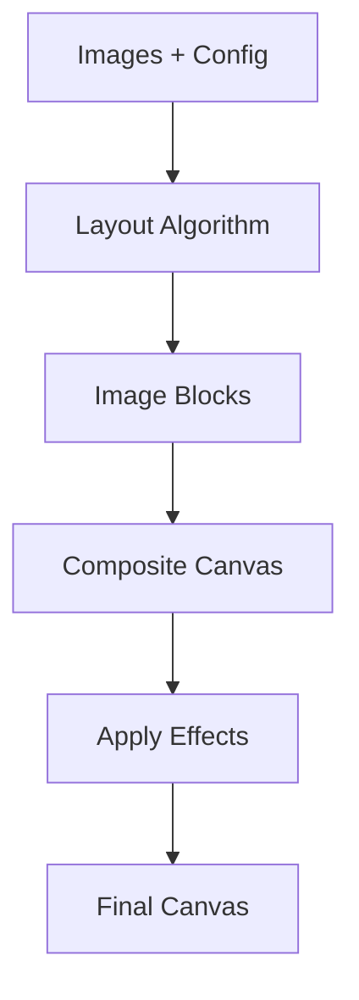

# PhotoWeave Core Modules

This guide covers the core modules that power PhotoWeave's collage generation engine.

## Collage Engine

The collage engine is responsible for generating collages from uploaded images. It supports both preview and full-resolution export.

### Core Generation Flow



### Main Generator

```typescript
// src/lib/collage/collage-generator.ts

export async function generateCollage(
  images: LoadedImage[],
  config: CollageConfig,
  onProgress?: (percent: number) => void,
): Promise<HTMLCanvasElement> {
  // Create canvas
  const canvas = document.createElement("canvas");
  canvas.width = config.widthPx;
  canvas.height = config.heightPx;

  // Composite collage
  await compositeCollage(images, config, canvas, false, onProgress);

  return canvas;
}

export function generatePreview(
  images: LoadedImage[],
  config: CollageConfig,
): HTMLCanvasElement {
  // Downscale for preview
  const maxDimension = 500;
  const scale = Math.min(
    maxDimension / config.widthPx,
    maxDimension / config.heightPx,
  );

  const canvas = document.createElement("canvas");
  canvas.width = config.widthPx * scale;
  canvas.height = config.heightPx * scale;

  // Composite collage (no face detection for speed)
  compositeCollage(images, config, canvas, true);

  return canvas;
}
```

### Composite Function

```typescript
async function compositeCollage(
  images: LoadedImage[],
  config: CollageConfig,
  canvas: HTMLCanvasElement,
  isPreview: boolean,
  onProgress?: (percent: number) => void,
): Promise<void> {
  const ctx = canvas.getContext("2d");
  if (!ctx) throw new Error("Failed to get canvas context");

  // Fill background
  ctx.fillStyle = config.backgroundColor;
  ctx.fillRect(0, 0, canvas.width, canvas.height);

  // Calculate spacing
  const spacing = spacingPixels(canvas.width, canvas.height, config.spacing);

  // Get layout blocks
  const blocks = getLayoutBlocks(
    images,
    config,
    canvas.width,
    canvas.height,
    spacing,
  );

  // Draw images
  for (let i = 0; i < blocks.length; i++) {
    const block = blocks[i];
    const image = images[block.imageIndex];

    // Draw image
    if (config.applyShadow) {
      drawImageWithShadow(
        ctx,
        image.bitmap,
        block.x,
        block.y,
        block.width,
        block.height,
      );
    } else {
      ctx.drawImage(image.bitmap, block.x, block.y, block.width, block.height);
    }

    // Update progress
    if (onProgress) {
      onProgress(Math.round(((i + 1) / blocks.length) * 100));
    }
  }
}
```

## Layout Algorithms

PhotoWeave supports two layout algorithms: Masonry and Grid.

### Masonry Layout

The masonry layout creates a Pinterest-style staggered arrangement where photos of different aspect ratios fit together seamlessly.

```typescript
// src/lib/collage/layouts/masonry.ts

export function masonryPack(
  images: LoadedImage[],
  canvasWidth: number,
  canvasHeight: number,
  spacing: number,
): ImageBlock[] {
  // Find optimal column count
  const columns = findOptimalColumns(images, canvasWidth, canvasHeight);

  // Distribute images across columns
  const columnHeights = new Array(columns).fill(0);
  const blocks: ImageBlock[] = [];

  for (const [i, img] of images.entries()) {
    // Find column with least height
    const col = columnHeights.indexOf(Math.min(...columnHeights));

    // Calculate block dimensions
    const blockWidth = (canvasWidth - spacing * (columns + 1)) / columns;
    const blockHeight = blockWidth / img.aspect;

    // Position block
    blocks.push({
      x: spacing + col * (blockWidth + spacing),
      y: columnHeights[col],
      width: blockWidth,
      height: blockHeight,
      imageIndex: i,
    });

    // Update column height
    columnHeights[col] += blockHeight + spacing;
  }

  return blocks;
}

function findOptimalColumns(
  images: LoadedImage[],
  canvasWidth: number,
  canvasHeight: number,
): number {
  let bestColumns = 2;
  let bestScore = Infinity;

  for (let columns = 2; columns <= 10; columns++) {
    const score = evaluateLayout(images, canvasWidth, canvasHeight, columns);
    if (score < bestScore) {
      bestScore = score;
      bestColumns = columns;
    }
  }

  return bestColumns;
}

function evaluateLayout(
  images: LoadedImage[],
  canvasWidth: number,
  canvasHeight: number,
  columns: number,
): number {
  // Calculate aspect penalty
  const blockWidth = canvasWidth / columns;
  const aspectPenalty = images.reduce((sum, img) => {
    const blockHeight = blockWidth / img.aspect;
    const aspect = blockWidth / blockHeight;
    return sum + Math.abs(aspect - 1);
  }, 0);

  // Calculate unevenness penalty
  const unevenness = images.length % columns;

  return aspectPenalty + unevenness * 10;
}
```

### Grid Layout

The grid layout creates a uniform arrangement with equal-sized cells.

```typescript
// src/lib/collage/layouts/grid.ts

export function gridPack(
  images: LoadedImage[],
  canvasWidth: number,
  canvasHeight: number,
  spacing: number,
): ImageBlock[] {
  // Calculate grid dimensions
  const aspectRatio = canvasWidth / canvasHeight;
  const columns = Math.floor(Math.sqrt(images.length * aspectRatio));
  const rows = Math.ceil(images.length / columns);

  // Calculate cell dimensions
  const cellWidth = (canvasWidth - spacing * (columns + 1)) / columns;
  const cellHeight = (canvasHeight - spacing * (rows + 1)) / rows;

  // Position images
  const blocks: ImageBlock[] = [];

  for (let i = 0; i < images.length; i++) {
    const col = i % columns;
    const row = Math.floor(i / columns);

    blocks.push({
      x: spacing + col * (cellWidth + spacing),
      y: spacing + row * (cellHeight + spacing),
      width: cellWidth,
      height: cellHeight,
      imageIndex: i,
    });
  }

  return blocks;
}

export function calculateOptimalGrid(
  numImages: number,
  canvasWidth: number,
  canvasHeight: number,
  spacing: number,
): GridInfo {
  const aspectRatio = canvasWidth / canvasHeight;
  const columns = Math.floor(Math.sqrt(numImages * aspectRatio));
  const rows = Math.ceil(numImages / columns);

  const isPerfect = columns * rows === numImages;

  if (isPerfect) {
    return {
      columns,
      rows,
      isPerfect,
      optimalNumImages: numImages,
      delta: 0,
    };
  }

  // Find closest perfect grid
  let bestDelta = 0;
  let bestOptimal = numImages;

  for (let delta = -10; delta <= 10; delta++) {
    const target = numImages + delta;
    if (target < 2) continue;

    const targetColumns = Math.floor(Math.sqrt(target * aspectRatio));
    const targetRows = Math.ceil(target / targetColumns);

    if (targetColumns * targetRows === target) {
      if (Math.abs(delta) < Math.abs(bestDelta) || bestDelta === 0) {
        bestDelta = delta;
        bestOptimal = target;
      }
    }
  }

  return {
    columns,
    rows,
    isPerfect: false,
    optimalNumImages: bestOptimal,
    delta: bestDelta,
  };
}
```

## Spacing Calculation

Spacing is calculated as a percentage of the canvas dimensions:

```typescript
// src/lib/collage/collage-generator.ts

function spacingPixels(
  canvasWidth: number,
  canvasHeight: number,
  spacingPercent: number,
): number {
  const minDimension = Math.min(canvasWidth, canvasHeight);
  return (minDimension * spacingPercent) / 100;
}
```

## Shadow Rendering

Drop shadows can be applied to images for a polished look:

```typescript
// src/lib/collage/shadow.ts

export function drawImageWithShadow(
  ctx: CanvasRenderingContext2D,
  image: ImageBitmap | HTMLImageElement,
  x: number,
  y: number,
  width: number,
  height: number,
): void {
  const shadowOffset = 10;
  const shadowBlur = 20;
  const shadowColor = "rgba(0, 0, 0, 0.3)";

  // Draw shadow
  ctx.save();
  ctx.shadowColor = shadowColor;
  ctx.shadowOffsetX = shadowOffset;
  ctx.shadowOffsetY = shadowOffset;
  ctx.shadowBlur = shadowBlur;
  ctx.drawImage(image, x, y, width, height);
  ctx.restore();
}

export function drawImageSimple(
  ctx: CanvasRenderingContext2D,
  image: ImageBitmap | HTMLImageElement,
  x: number,
  y: number,
  width: number,
  height: number,
): void {
  ctx.drawImage(image, x, y, width, height);
}
```

## Preview vs Full Resolution

### Preview Generation

Previews are optimized for speed:

- Images are downscaled to max 1600px
- Canvas is limited to 500px on longest edge
- Face detection is disabled
- Simple center-crop is used

```typescript
export function generatePreview(
  images: LoadedImage[],
  config: CollageConfig,
): HTMLCanvasElement {
  // Downscale images
  const scaledImages = images.map((img) => ({
    ...img,
    bitmap: downscaleBitmap(img.bitmap, 1600),
  }));

  // Limit canvas size
  const maxDimension = 500;
  const scale = Math.min(
    maxDimension / config.widthPx,
    maxDimension / config.heightPx,
  );

  const canvas = document.createElement("canvas");
  canvas.width = config.widthPx * scale;
  canvas.height = config.heightPx * scale;

  // Composite without face detection
  compositeCollage(scaledImages, config, canvas, true);

  return canvas;
}
```

### Full Resolution Export

Full export uses original images and all features:

- Original image resolution
- Full canvas size up to 20,000×20,000px
- Face detection enabled (if configured)
- Smart cropping applied

```typescript
export async function generateCollage(
  images: LoadedImage[],
  config: CollageConfig,
  onProgress?: (percent: number) => void,
): Promise<HTMLCanvasElement> {
  const canvas = document.createElement("canvas");
  canvas.width = config.widthPx;
  canvas.height = config.heightPx;

  // Composite with all features
  await compositeCollage(images, config, canvas, false, onProgress);

  return canvas;
}
```

## Configuration

The collage configuration is defined in `src/lib/collage/config.ts`:

```typescript
export interface CollageConfig {
  widthPx: number;
  heightPx: number;
  widthMm: number;
  heightMm: number;
  dpi: number;
  dimensionMode: DimensionMode;
  layoutStyle: LayoutStyle;
  spacing: number;
  backgroundColor: string;
  maintainAspectRatio: boolean;
  applyShadow: boolean;
  outputFormat: OutputFormat;
  faceAwareCropping: boolean;
  faceMargin: number;
  pretrimBorders: boolean;
  debugFaces: boolean;
}
```

## Next Steps

- Read the [Face Detection Documentation](./10-face-detection.md) for MediaPipe integration
- Check the [Image Processing Documentation](./11-image-processing.md) for image utilities
- Review the [Architecture Documentation](./03-architecture.md) for overall architecture
