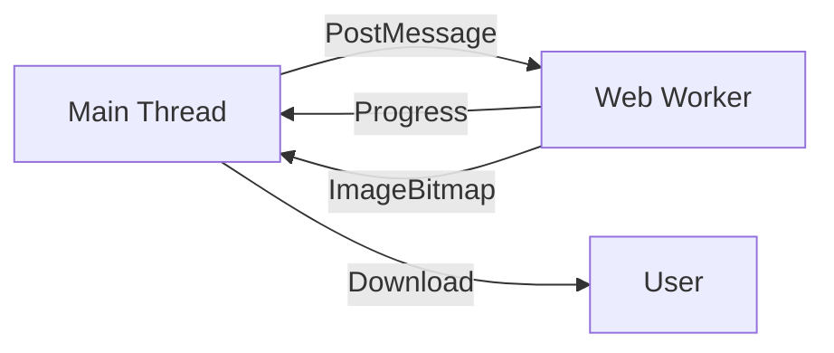

# PhotoWeave Image Processing

This guide covers the image processing utilities and Web Worker implementation in PhotoWeave.

## Image Loading

### Loading Images as Bitmaps

Images are loaded as ImageBitmaps for efficient rendering:

```typescript
// src/hooks/useCollage.ts

export async function loadImagesAsBitmaps(
  files: File[],
): Promise<LoadedImage[]> {
  const images: LoadedImage[] = [];

  for (const file of files) {
    const bitmap = await createImageBitmap(file);
    const aspect = bitmap.width / bitmap.height;

    images.push({
      bitmap,
      width: bitmap.width,
      height: bitmap.height,
      aspect,
      file,
    });
  }

  return images;
}

export interface LoadedImage {
  bitmap: ImageBitmap;
  width: number;
  height: number;
  aspect: number;
  file: File;
}
```

### Memory Management

ImageBitmaps must be closed to prevent memory leaks:

```typescript
// src/hooks/useCollage.ts

const removeImage = useCallback((index: number) => {
  setImages((prev) => {
    const newImages = prev.filter((_, i) => i !== index);
    // Close bitmap to free memory
    prev[index].bitmap.close();
    return newImages;
  });
}, []);

const clearImages = useCallback(() => {
  setImages((prev) => {
    // Close all bitmaps
    prev.forEach((img) => img.bitmap.close());
    return [];
  });
}, []);
```

## Image Resizing

### Smart Resize

Resize images while maintaining aspect ratio:

```typescript
// src/lib/collage/image-processing.ts

export function smartResize(
  bitmap: ImageBitmap,
  maxWidth: number,
  maxHeight: number,
): ImageBitmap {
  const aspect = bitmap.width / bitmap.height;
  let width = bitmap.width;
  let height = bitmap.height;

  if (width > maxWidth) {
    width = maxWidth;
    height = width / aspect;
  }

  if (height > maxHeight) {
    height = maxHeight;
    width = height * aspect;
  }

  const canvas = document.createElement("canvas");
  canvas.width = width;
  canvas.height = height;

  const ctx = canvas.getContext("2d");
  if (!ctx) throw new Error("Failed to get canvas context");

  ctx.drawImage(bitmap, 0, 0, width, height);

  return createImageBitmap(canvas);
}
```

### Downscale for Preview

Downscale images for fast preview generation:

```typescript
export function downscaleBitmap(
  bitmap: ImageBitmap,
  maxDimension: number,
): ImageBitmap {
  const maxSide = Math.max(bitmap.width, bitmap.height);
  if (maxSide <= maxDimension) return bitmap;

  const scale = maxDimension / maxSide;
  const width = Math.round(bitmap.width * scale);
  const height = Math.round(bitmap.height * scale);

  const canvas = document.createElement("canvas");
  canvas.width = width;
  canvas.height = height;

  const ctx = canvas.getContext("2d");
  if (!ctx) throw new Error("Failed to get canvas context");

  ctx.drawImage(bitmap, 0, 0, width, height);

  return createImageBitmap(canvas);
}
```

## Border Trimming

### Trim Uniform Borders

Detect and remove uniform borders from images:

```typescript
// src/lib/collage/image-processing.ts

export function trimBorders(
  bitmap: ImageBitmap,
  threshold: number = 10,
): ImageBitmap {
  const canvas = document.createElement("canvas");
  canvas.width = bitmap.width;
  canvas.height = bitmap.height;

  const ctx = canvas.getContext("2d");
  if (!ctx) throw new Error("Failed to get canvas context");

  ctx.drawImage(bitmap, 0, 0);

  const imageData = ctx.getImageData(0, 0, canvas.width, canvas.height);
  const data = imageData.data;

  // Find top border
  let top = 0;
  for (let y = 0; y < canvas.height; y++) {
    let isBorder = true;
    for (let x = 0; x < canvas.width; x++) {
      const i = (y * canvas.width + x) * 4;
      const r = data[i];
      const g = data[i + 1];
      const b = data[i + 2];
      const brightness = (r + g + b) / 3;

      if (Math.abs(brightness - 255) > threshold) {
        isBorder = false;
        break;
      }
    }
    if (!isBorder) {
      top = y;
      break;
    }
  }

  // Find bottom border
  let bottom = canvas.height;
  for (let y = canvas.height - 1; y >= 0; y--) {
    let isBorder = true;
    for (let x = 0; x < canvas.width; x++) {
      const i = (y * canvas.width + x) * 4;
      const r = data[i];
      const g = data[i + 1];
      const b = data[i + 2];
      const brightness = (r + g + b) / 3;

      if (Math.abs(brightness - 255) > threshold) {
        isBorder = false;
        break;
      }
    }
    if (!isBorder) {
      bottom = y + 1;
      break;
    }
  }

  // Find left border
  let left = 0;
  for (let x = 0; x < canvas.width; x++) {
    let isBorder = true;
    for (let y = 0; y < canvas.height; y++) {
      const i = (y * canvas.width + x) * 4;
      const r = data[i];
      const g = data[i + 1];
      const b = data[i + 2];
      const brightness = (r + g + b) / 3;

      if (Math.abs(brightness - 255) > threshold) {
        isBorder = false;
        break;
      }
    }
    if (!isBorder) {
      left = x;
      break;
    }
  }

  // Find right border
  let right = canvas.width;
  for (let x = canvas.width - 1; x >= 0; x--) {
    let isBorder = true;
    for (let y = 0; y < canvas.height; y++) {
      const i = (y * canvas.width + x) * 4;
      const r = data[i];
      const g = data[i + 1];
      const b = data[i + 2];
      const brightness = (r + g + b) / 3;

      if (Math.abs(brightness - 255) > threshold) {
        isBorder = false;
        break;
      }
    }
    if (!isBorder) {
      right = x + 1;
      break;
    }
  }

  // Crop image
  const croppedWidth = right - left;
  const croppedHeight = bottom - top;

  const croppedCanvas = document.createElement("canvas");
  croppedCanvas.width = croppedWidth;
  croppedCanvas.height = croppedHeight;

  const croppedCtx = croppedCanvas.getContext("2d");
  if (!croppedCtx) throw new Error("Failed to get canvas context");

  croppedCtx.drawImage(
    canvas,
    left,
    top,
    croppedWidth,
    croppedHeight,
    0,
    0,
    croppedWidth,
    croppedHeight,
  );

  return createImageBitmap(croppedCanvas);
}
```

## Web Worker Implementation

### Worker Architecture

PhotoWeave uses Web Workers to offload heavy image processing from the main thread:



### Creating a Worker

```typescript
// src/lib/collage/worker-bridge.ts

export function createWorker(): Worker {
  return new Worker(new URL("./collage-worker.ts", import.meta.url), {
    type: "module",
  });
}
```

### Worker Message Protocol

The worker communicates with the main thread using messages:

```typescript
// Main thread sends:
{
  images: LoadedImage[],
  config: CollageConfig
}

// Worker sends progress:
{
  type: "progress",
  percent: number
}

// Worker sends result:
{
  type: "done",
  imageBitmap: ImageBitmap
}

// Worker sends error:
{
  type: "error",
  message: string
}
```

### Worker Implementation

```typescript
// src/lib/collage/collage-worker.ts

import { generateCollage } from "./collage-generator";

self.onmessage = async (e) => {
  const { images, config } = e.data;

  try {
    // Generate collage
    const canvas = await generateCollage(images, config, (percent) => {
      // Send progress updates
      self.postMessage({ type: "progress", percent });
    });

    // Convert to ImageBitmap
    const imageBitmap = await createImageBitmap(canvas);

    // Send result
    self.postMessage({ type: "done", imageBitmap }, [imageBitmap]);
  } catch (error) {
    // Send error
    self.postMessage({
      type: "error",
      message: error instanceof Error ? error.message : "Unknown error",
    });
  }
};
```

### Worker Bridge

The worker bridge manages worker lifecycle and communication:

```typescript
// src/lib/collage/worker-bridge.ts

export async function generateCollageWithWorker(
  images: LoadedImage[],
  config: CollageConfig,
  onProgress: (percent: number) => void,
): Promise<HTMLCanvasElement> {
  // Check if OffscreenCanvas is supported
  if (typeof OffscreenCanvas === "undefined") {
    // Fallback to main thread
    return generateCollage(images, config, onProgress);
  }

  // Create worker
  const worker = createWorker();

  // Send data
  worker.postMessage({
    images: images.map((img) => ({
      bitmap: img.bitmap,
      width: img.width,
      height: img.height,
      aspect: img.aspect,
    })),
    config: {
      ...config,
      faceAwareCropping: false, // MediaPipe doesn't work in workers
      debugFaces: false,
    },
  });

  // Wait for completion
  const result = await new Promise<ImageBitmap>((resolve, reject) => {
    worker.onmessage = (e) => {
      if (e.data.type === "progress") {
        onProgress(e.data.percent);
      } else if (e.data.type === "done") {
        resolve(e.data.imageBitmap);
      } else if (e.data.type === "error") {
        reject(new Error(e.data.message));
      }
    };
  });

  // Terminate worker
  worker.terminate();

  // Convert to canvas
  const canvas = document.createElement("canvas");
  canvas.width = result.width;
  canvas.height = result.height;

  const ctx = canvas.getContext("2d");
  if (!ctx) throw new Error("Failed to get canvas context");

  ctx.drawImage(result, 0, 0);

  return canvas;
}
```

### Fallback Strategy

If Web Workers are not supported, the application falls back to main-thread processing:

```typescript
export async function generateCollageWithWorker(
  images: LoadedImage[],
  config: CollageConfig,
  onProgress: (percent: number) => void,
): Promise<HTMLCanvasElement> {
  try {
    // Try to use worker
    return await generateCollageWithWorkerInternal(images, config, onProgress);
  } catch (error) {
    console.warn("Worker failed, falling back to main thread:", error);
    // Fallback to main thread
    return generateCollage(images, config, onProgress);
  }
}
```

## OffscreenCanvas

OffscreenCanvas enables rendering in Web Workers:

```typescript
// In worker
const canvas = new OffscreenCanvas(width, height);
const ctx = canvas.getContext("2d");

// Draw images
ctx.drawImage(bitmap, x, y, width, height);

// Transfer to main thread
const imageBitmap = await createImageBitmap(canvas);
postMessage({ type: "done", imageBitmap }, [imageBitmap]);
```

## Performance Optimizations

### Zero-Copy Transfer

ImageBitmaps are transferred without copying:

```typescript
// Transfer ImageBitmap
postMessage({ type: "done", imageBitmap }, [imageBitmap]);
```

### Debounced Preview

Preview generation is debounced to prevent excessive re-renders:

```typescript
useEffect(() => {
  const timer = setTimeout(() => {
    generatePreview();
  }, 300);

  return () => clearTimeout(timer);
}, [images, config]);
```

### Preview Downscaling

Previews are rendered at low resolution:

```typescript
const maxDimension = 500;
const scale = Math.min(
  maxDimension / config.widthPx,
  maxDimension / config.heightPx,
);
```

## Next Steps

- Read the [Collage Engine Documentation](./09-collage-engine.md) for layout algorithms
- Check the [Face Detection Documentation](./10-face-detection.md) for MediaPipe integration
- Review the [Architecture Documentation](./03-architecture.md) for overall architecture
